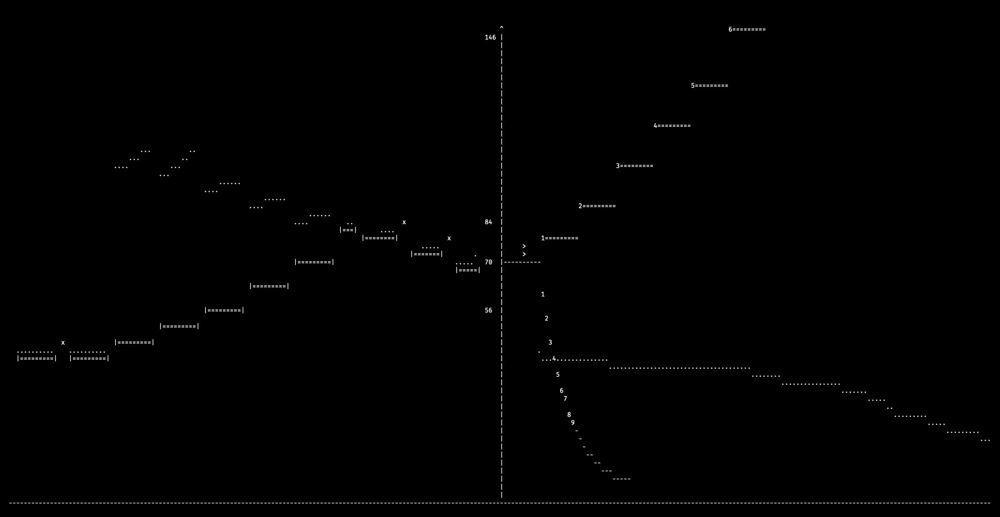
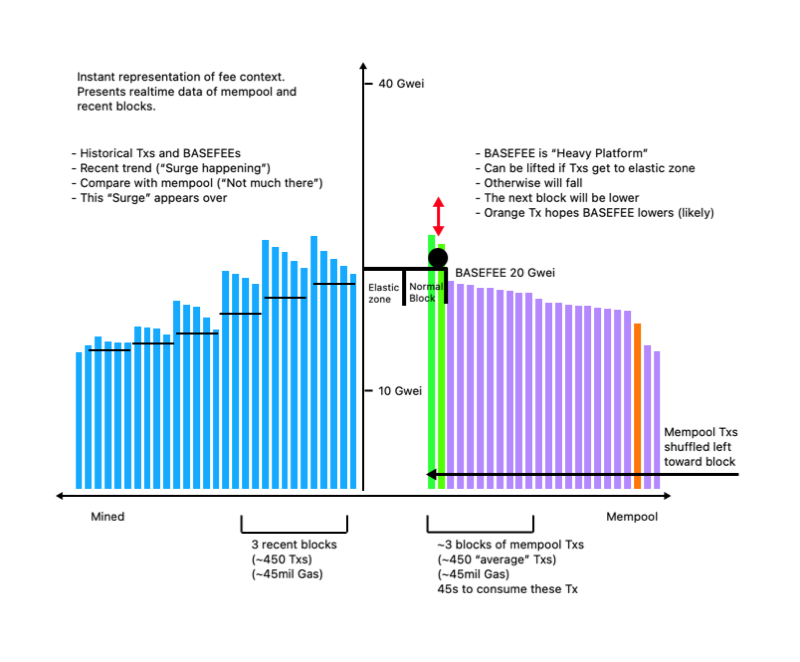

# gidget-gadget

Number go up, number go down: 1559 as a game.

An implementation of some basefee dynamics.

- Play as the transaction pool mogul.
- Watch as blocks expand and contract with demand.
- See gwei-gwei into the future.
- Experience the joy of exponentiation.

## How to play

``gidget-gadget`` uses python 3.x and native libraries only, so no
additional installation is required. The interface is a terminal window
with keyboard input. Run:

``python3 play.py``

Controls:
- Press `q` to quit
- Press a number: `5` sends 150 transacations each with a 50 (+/-20%) Gwei basefee

Mempool transactions are sorted, queued and fed left to right to the block producer. The transactions are valid if their fee is greater than the basefee.

Blocks are constructed and can be seen exiting left to right as a record of previous transactions and basefees.

## How it works

The system models a transaction price as a basefee only, there is no other fee component. Blocks are elastic and can contain twice normal quantities if there is demand. All transactions are uniform in size.

If the mempool is flooded with transactions with gas price above the basefee, the basefee will rise by up to 12.5%. The maximum possible basefees in that scenario are projected as an upward curve with numbered future blocks. The width of the projected twice-normal blocks shows how many mempool transactions would be absorbed in that scenario. The width of all transactions above that projection can be used to infer the time (8 blocks * 14s = ~2 mins) to handle the increased load.

If no transactions meet criteria, the basefee falls. These basefee values are also projected. The time until blocks start containing transactions can be estimated. Take number of the first projected block that intersects a mempool transaction and convert to time (3 blocks * 14s = ~40 secs).

Parameters:
- Stable block size: 15 million gas
- Max block capacity: 30 million gas
- Transactions per block: ~150 (0-300)
- Block time: 2 seconds
- Tx size: 100,000 gas
- Fee range: Currently limited to numpad (~10-90 gwei)

Its rickety and doesn't simulate all the dynamics of the fee market. Feel free to play around with the parameters and leave suggestions/PRs.

## Rationale

This is an experiment to see if:
- Visualising the basefee dynamics in this way provides a way to quickly absorb the context of the fee market.
    - What is the value of a mempool visualiser that presents unmodified fee data to users?
    - Does looking at historical prices and mempool prices side by side provide rich context for planning transactions?
    - Are there visual patterns that can reliably predict future gas prices?
- Experiencing the rate of change of the basefee is beneficial in understanding the market dynamics.

