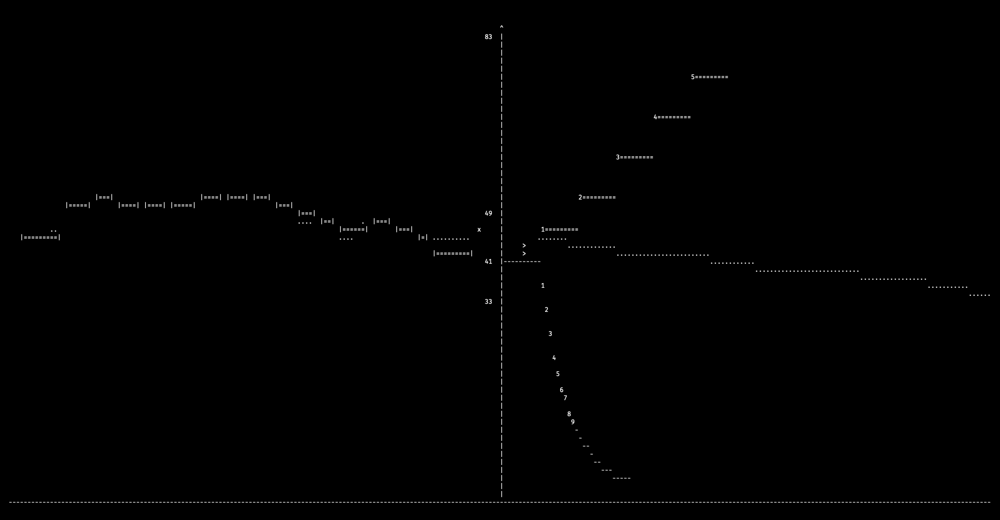
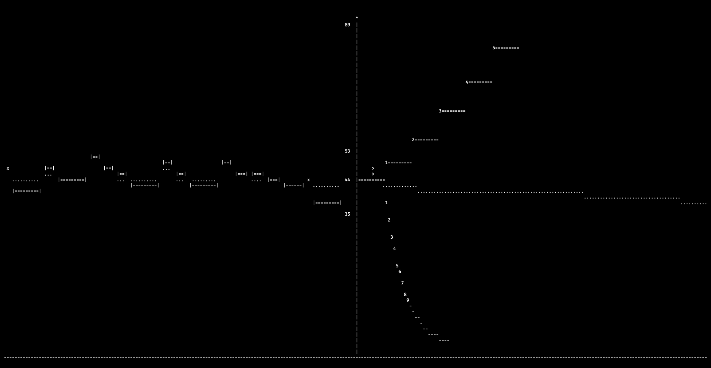
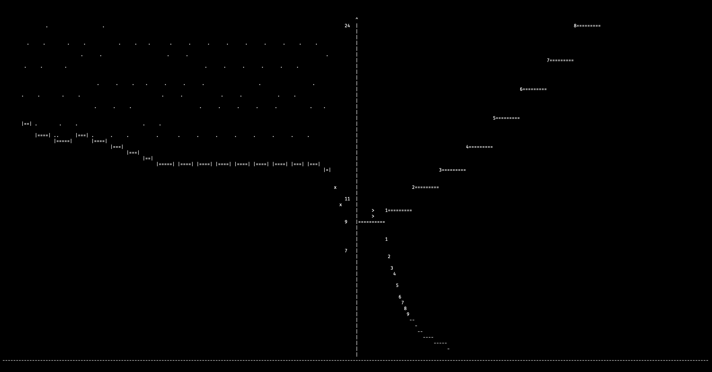
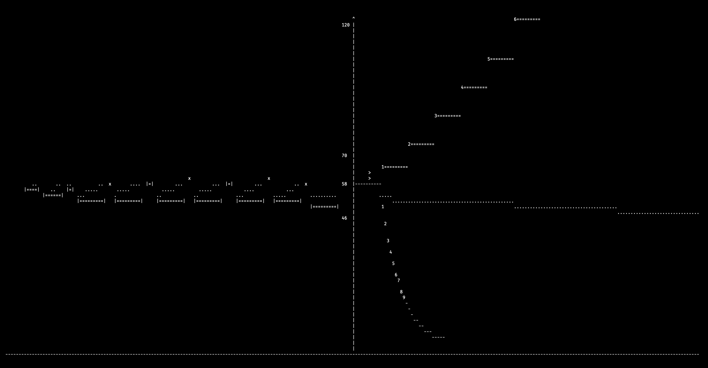
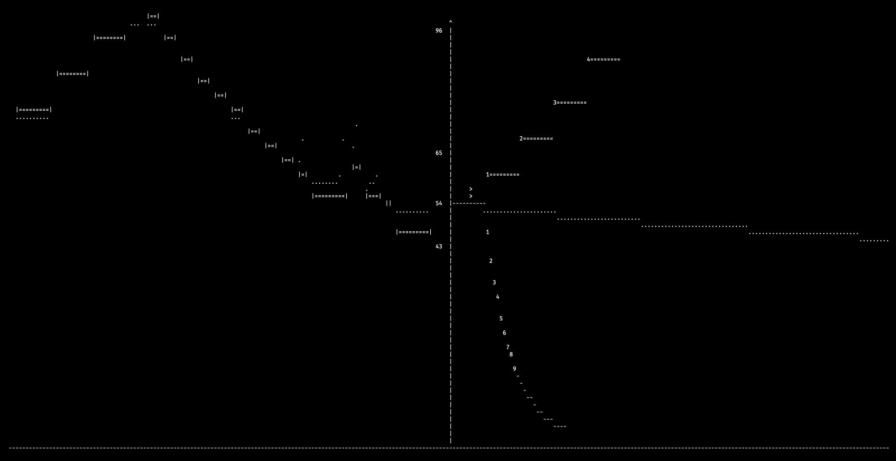
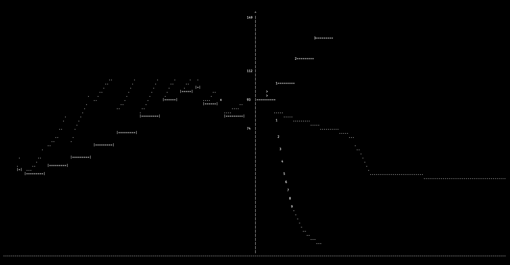
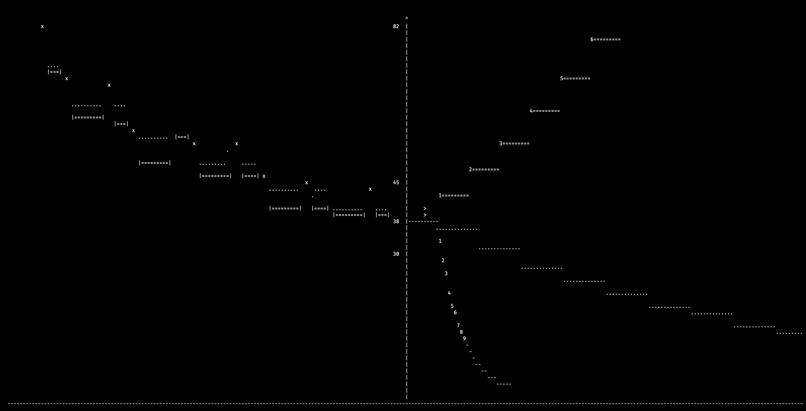

## Patterns observed

Below are some situations that can be created in gidget-gadget. Whether
they represent realistic scenarios is left as a gedankenexperiment.

 
**Flow equilibrium**: Sending out transactions at the current basefee
creates a stable pattern when the inflow matches the block production.
The basefee wanders gradually.

 
**Heartbeat mode**: High demand at one price and a steady trickle of
demand above. The basefee bounces on a floor.

 
**Insured Equilibrium**: A steady trickle of transactions that are
ready to be included even if demand picks up. Basefee is steady.

 
**Number fixation**: Everyone sends with the same fee (e.g. 50gwei),
stable oscillation occurs. Double-sized blocks followed by empty blocks
(same net throughput). Basefee oscillates.

 
**Interested minority**: Users send at the current basefee at a rate
lower than block production. A steady decline of the basefee until
demand is found.

 
**Flash mob**: A discrete group of people suddenly appear and their
rate of participation exceeds capacity, but only briefly. Basefee rises
quickly and falls quickly over some period.

This pattern raises an interesting question about mempool eviction
policy. For example if there was standard eviction for transactions that
fall more than four basefee-rises behind or x minutes waiting, such a
system might be:
- Good
    - Users can resubmit higher and get their important transaction
    included with more control.
    - Users can wait and resubmit at their original price and achieve
        the same outcome as when the mempool never dropped transactions.
- Bad
    - It may encourage the network to "chase" these discrete
    events, giving the price rise more inertia than it would otherwise.

One perspective might be that wallets have the power to elicit a users
desire and generate an out-of-protocol resubmission plan. If
transactions are dropped quickly, there is greater control, at the cost
of more explicit planning.

 
**Inattentive decline**: As demand falls, popular lower price tiers
trigger double blocks. The basefee rises, but if no new transactions are
added, the next block is empty. The basefee then continues its sawtooth
descent.
